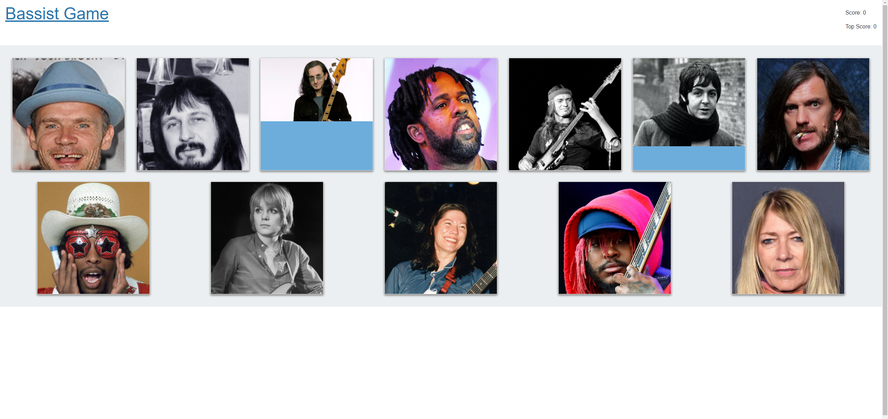

# Bassist Click Game

## Summary

This application is a small react application that runs a game where the user tries to click all 12 famous bassists in a row without any repeats:

* [See Live Site](https://nameless-wildwood-28032.herokuapp.com/)

## Key Pieces of Code

## Built With

* [HTML](https://developer.mozilla.org/en-US/docs/Web/HTML)
* [CSS](https://developer.mozilla.org/en-US/docs/Web/CSS)
* [React](https://reactjs.org/)
* [Bootstraps](https://getbootstrap.com/)

## Licenses

 
The MIT License (MIT); Copyright 2011-2020 Twitter, Inc.; Copyright 2011-2020 The Bootstrap Authors

## Authors

### **Shaun Limbeek** 

- [Link to Github](https://github.com/slimbeek6/)
- [Link to LinkedIn](https://www.linkedin.com/in/shaun-limbeek/)
- [Link to Portfolio](https://afternoon-temple-06204.herokuapp.com/)
